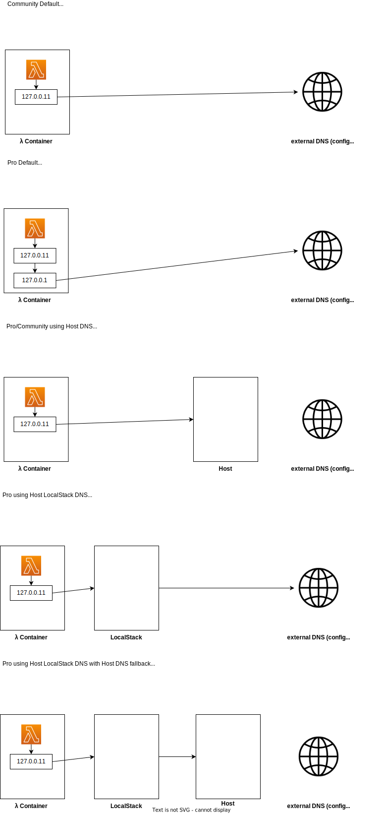

# LocalStack Custom DNS Example

This example explores several custom DNS configuration using LocalStack and Lambda.

`127.0.0.11` refers to the Docker DNS resolver.

## LocalStack Documentation

* [Transparent Endpoint Injection](https://docs.localstack.cloud/user-guide/tools/transparent-endpoint-injection/)
* [Configuration](https://docs.localstack.cloud/references/configuration/)
* [Network troubleshooting](https://docs.localstack.cloud/references/network-troubleshooting/)

## Requirements

* `make`
* [samlocal](https://github.com/localstack/aws-sam-cli-local)
* [awslocal](https://github.com/localstack/awscli-local)

## Deploy

`make deploy`

## Invoke

`make invoke`

## Setup custom DNS server

`make install` (macOS)

Installation based on [DNS server macOS tutorial](https://zhimin-wen.medium.com/setup-local-dns-server-on-macbook-82ad22e76f2a)

## Start DNS server

`make start_dns` (requires sudo for binding port 53)

Ensure that port 53 is free and not used by "Internet Sharing" (see [LocalStack DNS documentation](https://docs.localstack.cloud/user-guide/tools/transparent-endpoint-injection/dns-server/#macos))
